# Abstract

There is a well-known relationship between electricity demand and temperature in the electricity industry, most commercial power suppliers use temperature to forecast energy demand. More and more Australian homes are considering adding solar panels as a source of renewable energy, the team is interested in whether adding solar power as another variable will improve the accuracy of the model that is currently being used. By using  neural network (NN) and long short-term memory (LSTM) models, we improved the accuracy of the energy forecasting by implementing the solar power output dataset along with the temperature dataset that were originally used. Using temperature and solar power datasets from 2017 to 2021, the team concluded that both NN and LSTM modelling techniques provided more accurate energy forecasting and comparing both models, LSTM is the superior model over NN. The findings from this experiment suggested that energy providers should consider implementing datasets from various renewable sources to improve its modelling accuracy in order to improve energy pricing and reduce wastage. Notably, the LSTM model outperformed existing models on Queensland data.


# Introduction {.label:s-intro}

Electricity has become increasingly vital in our modern world, with per capita energy consumption more than doubling from 1978 to 2019, signaling a substantial shift in energy use patterns (World Bank, 2023). This surge is propelled not just by the global transition to electric vehicles, which promise to replace internal combustion engines, but also by other factors such as digitalisation, technological advancements, and the electrification of industries and home heating systems that once relied on fossil fuels. Additionally, the push towards sustainability has spurred the adoption of electrically powered technologies and the integration of renewable energy sources into the grid, further driving up electricity demand.


There is a fundamental relationship between energy demand and external ambient temperature. Looking at the historic energy demand in the country, the energy demand is proportional to the external ambient temperature as the temperature dictates whether residential customers will require heating or air conditioning for comfortable living conditions. Forecasting energy demand is important for energy suppliers as it optimises profit by preventing under or over-production. In a competitive market, forecasting energy demand is essential for predicting electricity pricing and demand.

Recalling from our project plan, our research question was to find out whether including commercial and residential solar energy production improves the energy demand forecasting accuracy. From this, we have come up with two hypotheses:

- **Null Hypothesis** ($H_0$): Temperature data alone is sufficient to reliably forecast electricity demand

- **Alternative Hypothesis** ($H_1$): Including the additional features of 'solar generation capacity' and/or 'solar radiation' improves the estimate of electricity demand.

In order to test the hypotheses, the team would require additional datasets, such as solar power generation data and public holidays. These datasets are not provided and are significantly related to our hypotheses. From the project plan, the team has chosen LSTM as the main method for modelling. Two models will then be built and compared in order to test if the hypotheses we listed above is valid.

Since the data used only ranges from 2017 to 2021, hence there are limitation in terms of accuracy for the model. Moreover, we are only specifically including solar power generation but no other renewable energy sources, this may also affect the accuracy of the final result. 

# Literature Review

From the previous literature review written in the project plan. The team has chosen to use convolutional neural network modeling and long short-term memory model as we believe these models will provide the best results compared to other models. We decided to conduct more literature review as the previous one was not sufficient in terms of breadth and depth.  

We have learnt that LSTMs can be used effectively in energy demand forecasting, as demonstrated by the research conducted by Abumohsen, Owda, and Owda  [@Abumohsen_Owda_Owda_2023]. Their study, which compares LSTM networks with other deep learning models like Gated Recurrent Unit (“GRU”) and traditional Recurrent Neural Network’s (“RNNs”), highlights the potential of these techniques in capturing the complex temporal dependencies of energy consumption data. This research highlights the importance of hyperparameter tuning and model optimisation in improving forecasting accuracy, which will play an important role in the success of our project. This study validates the effectiveness of LSTM networks in predicting energy demand and suggests that with the right model configuration and parameter settings, LSTMs can significantly aid electricity suppliers and regulators in operational planning, cost reduction, and grid stability. 

Another study by Daniel L. Marino, Kasun Amarasinghe, and Milos Manic delves into the application of Long Short-Term Memory (LSTM) networks for building energy load forecasting. This research, conducted at Virginia Commonwealth University, evaluates two LSTM configurations: the conventional model and a novel Sequence to Sequence (S2S) architecture, tested against residential electricity consumption data. The findings reveal that the standard LSTM is effective for hourly data but falls short with minute-by-minute analysis. Conversely, the S2S model excels in both scenarios, showcasing its potential for improving energy management in smart grid environments. The comparative success against other deep learning methods underscores the significance of this approach[@Amarasinghe_Marino_Manic_2017]. 
   
Similarly, research from Pablo de Olavide University in Spain conducted by Torres, Martinez-Alverez and Troncoso also utilized LSTM model to predict the electricity demand in the next 4-hour window. They used an algorithm called coronavirus optimization algorithm (CVOA) to select the best hyperparameter for the LSTM model. Subsequently, nine and a half years of electricity demand dataset in 15-minute interval was fed into the model, and comparing to traditional methods, they were able to achieve an error rate of less than 1.5% [@Torres_Martínez-Álvarez_Troncoso_2022] Again, this research proofs that LSTM models is suitable for processing time-series data and gives our team confidence in building a model with high accuracy.  

Other than LSTM, the team would also like to compare the results of using LSTM and CNN modeling. Some research team used CNN as a method to predict short and long-term that ranges from 7 to 60 days, with demand data from 2003 to 2020, where 14 years’ worth of data was used for training and validation purposes and the rest of them for testing. The team was able to achieve results with a 0.992 r squared value and a mean absolute error of 0.025 from the CNN model.[@Kang_Lim_Tayara_Chong_2020] Several other studies have shown that by combining both LSTM and CNN technique into their modeling can also provide a better result than solely just ultilising one of them as shown in the research done by Kim and Cho in 2019, Chung and Jang in 2022. [@Kim_Cho_2019][@Chung_Jang_2022]

Both techniques provided confidence that they are suitable for our purpose for integrating solar panel power production into electricity demand forecasting as shown by the researches done above. 

A Jupyter notebook describing the steps taken in our analysis can be found in `~/report/Wattsup_energy_forecast.ipynb`. Following is a description.

# Loading the Data

## Loading the given dataset

### Initial Code

Python was used to extract, transform and to load the data (ETL) into our notebook for further Exploratory Data Analysis (EDA) and modelling.
Unzipping programmatically ensures the repeatability of the data extraction process while ensuring that no human errors were introduced in the process as the number of files grows

To unzip the data, the `os` and the `zipfile` libraries were used. The `os` library was utilized to create and verify the existence of directories, and to walk through the directory structure of the source folder, identifying ZIP files. The `zipfile` library was employed to open and extract these ZIP files. The function `extract_all_zips` was defined to automate the extraction process. It accepts two parameters: `source_dir`, which specifies the directory containing the ZIP files, and `dest_dir`, the directory where the contents of the ZIP files are to be extracted. The function first ensures that the destination directory exists, creating it if necessary. It then iterates over all files in the source directory and its subdirectories, checks for files ending with '.zip', and extracts them into the specified destination directory. This function was called with relative paths to the source directory (`'../data/Australia'`) and the destination directory (`'../extracted_zips'`) as arguments to process and extract ZIP files located in the specified source directory.


After unzipping the given data, it's time to import them with pandas into a dictionary for automated access. This is achieved by using a function create_dataframes_dict, which iterates through a specified base directory to find and read all CSV files into pandas DataFrames. Each DataFrame is then stored in a dictionary with keys uniquely identifying each file based on its name, without the extension, and potentially incorporating its directory name.

The function first initializes an empty dictionary to store the DataFrames. It then walks through each directory and subdirectory within the provided base directory, identifying all CSV files. For each CSV file found, the function constructs the full file path, reads the file into a DataFrame using pd.read_csv, and adds it to the dictionary with a key derived from the file name. The function returns this dictionary, making it easy to access each DataFrame by its unique key.

The function was called with base_directory set to '../extracted_zips', pointing to the directory containing the folders with CSV files after the data extraction process. This directory was used to populate a dictionary dataframes_dict with DataFrames, allowing for automated and organized access to the data contained within each CSV file.

### Refactoring and simplifying the code

After establishing the data ingestion steps, a refactoring step was applied to simplify the code seen in the notebook and to focus on the subsequent modelling. This step ensures that the loading steps are abstracted, and the focus would only be targeted to the models created, increasing efficiency in testing the methods.

The module `watts_up.py` was created, and placed in a folder `src` in the same repository of the notebook; and is imported into the notebook using the following line:
```python
import src.watts_up as wup
```

The codes for different tasks were placed in python methods. This simplified the interface we have in our notebook. For instance, when extracting zips, the needed libraries and functions were encapsulated in a single function that would do all the required steps to unznip, and would only need the source directory and the destination directory. This simplified the needed code from around 15 lines to the following 3 lines:
```python
source_directory = '../data/Australia'
destination_directory = '../extracted_zips'
wup.extract_all_zips(source_directory, destination_directory)
```

The following functions were written in the module. They use the Don't Repeat Yourself (DRY) paradigm for reusability and cover the data loading and an early EDA, which will be discussed in a subsequent section.

`watts_up`:

- `wup.extract_all_zips(source_dir, dest_dir)`: Extracts all ZIP files from a specified source directory to a destination directory, creating the destination if it doesn't exist.
  
- `wup.create_dataframes_dict(base_directory)`: Creates a dictionary of DataFrames from CSV files found in subdirectories of a base directory, keyed by CSV file names.
- `wup.display_dataframes(dataframes)`: Displays basic information and the first few rows for each DataFrame in a given dictionary of DataFrames.
- `wup.organize_and_print_dataframes(dataframes_dict)`: Organizes DataFrames by state based on naming conventions and prints out each DataFrame's name under its corresponding state.
- `wup.get_dataframe_from_state(data_by_state, state, dataframe_key)`: Retrieves a specific DataFrame from a nested dictionary structure based on state and DataFrame key.
- `wup.convert_columns_to_datetime(df, columns)`: Converts specified columns of a DataFrame to datetime format if they exist.
- `wup.convert_df_columns_to_datetime(data_by_state, columns_to_convert)`: Applies datetime conversion to specified columns across all DataFrames within a nested dictionary structure.
- `wup.check_column_conversion(df, column_name)`: Checks if a specific column in a DataFrame has been successfully converted to a datetime object.
- `wup.check_datetime_conversions(data_by_state, columns)`: Verifies and prints whether specified columns in each DataFrame within a nested dictionary have been successfully converted to datetime objects.
- `wup.print_missing_values_summary(data_by_state)`: Prints a summary of missing values for each DataFrame within a nested dictionary structure, categorized by state.
- `wup.plot_column_distributions(data_by_state, columns)`: Plots the distribution of specified columns for each DataFrame within a nested dictionary structure, categorized by state.

## Loading PV data

An extra rooftop PV dataset was needed for the analysis. This dataset needs to be scraped from the following link: https://nemweb.com.au/Data_Archive/Wholesale_Electricity/MMSDM/.

For the puposes of this project, we are interested in the data between 2017 and 2023

### Python code to download
For the project, Python's `requests` library was used to automate the retrieval of ZIP files containing the data from the web. The URLs were constructed dynamically for each month of each year within the specified range, adhering to the naming convention and directory structure observed on the website. The file names were prefixed and suffixed appropriately to match the naming format provided by the site.

A `download_file(url, path)` function was defined to manage the HTTP request for each file's URL. If the server responded positively, the content was written to a local file in a pre-determined directory, ensuring the preservation of the data structure. This function printed out the status of each download attempt, helping track progress and identify any issues. The main block of the code iterated over each year and month, constructed the full URL for the corresponding data file, and called the `download_file` function to perform the download.

The `Path` object from the `pathlib` library specified the directory for storing the downloaded files and ensured that the necessary directories existed. The code was initiated with a loop over the specified range of years and months, systematically downloading each file to the local system, thereby automating the process of data collection for analysis or further processing. The completion of all downloads was confirmed with a final print statement.

### Unzipping
A further step leading to the loading of the data into a pandas dataframe for analysis involved unzipping the files and storing them into an organized folder structure. The Python `zipfile` library was used to manage the extraction of ZIP files, while the `pathlib` library took care of file path operations. The code specified a directory containing the ZIP files and created a target directory for the unzipped data, ensuring it existed before proceeding with unzipping. A loop was implemented to iterate over each ZIP file found in the specified directory. For each file, the `zipfile.ZipFile(file,'r')` method was invoked to open the ZIP file in read mode, and contents were extracted into the designated unzipped directory. Each successful extraction was acknowledged with a print statement indicating the file's name and the destination of the unzipped content.

### Loading Into `pandas` Dataframes
Now that the unzipped files were in place, it was time to load them, and pandas was used for this purpose. The Python script utilized the `pathlib` and `pandas` libraries to facilitate file management and data manipulation. Initially, the script identified all CSV files in the designated directory, storing the paths to these files in a list. If no CSV files were found, the script printed a notification message.

Once the file paths were established, the script loaded the first CSV file to establish a baseline for the column structure using pandas' `read_csv` function with the `header=1` parameter, which specified that the second row of the file should be treated as the header. The columns from this initial file were stored and printed.

The script then iterated over the remaining CSV files in the list, loading each one to compare its column structure against the baseline. If a file's column structure did not match the baseline, a flag was set to false, and a message was printed indicating which file differed. Finally, the script checked the flag to determine if all files had a consistent column structure, and appropriate messages were printed based on this check. This process ensured that all data files were compatible in terms of their structure before any further data processing or analysis was performed.

### Combining into one Dataframe
Our final step before analysis was to have a combined CSV. Using Python's `pandas` library and the `pathlib` module, the script performed this integration. First, it searched through the specified directory to find all CSV files, reading each one into a separate DataFrame. The `header=1` parameter was used to ensure the second row of each file was used as the header.

After all individual DataFrames were created and stored in a list, the script combined them into a single DataFrame using `pandas.concat`, with the `ignore_index=True` option to reset the index in the resulting DataFrame. This approach ensured that the data from each file was seamlessly appended without any index overlap.

The combined DataFrame was then saved back to disk as a new CSV file in the same directory as the original files, ensuring all data was consolidated in one accessible location. The path for the new combined CSV was constructed using the `pathlib` module to maintain consistency with file handling operations. The completion of this task was confirmed with a print statement that indicated the location of the saved combined CSV file, marking the readiness of the data for subsequent analysis steps.

# Describing the Data
## Description of the Github Data
**General Overview The Github Data**

The given data that the team will be examining is stored as CSV files in Github. It includes independent variables such as the date of the year, the location and recorded temperature; and dependent variables such as the total demand and the forecasted demand.  In total, we are dealing with 13 million, which can be considered as a large dataset. The data is a time series which can introduce more complexity in the model. This complexity, together with the size of the data are uan indicator that the usage of GPUs to accelerate the training of our model. Tools such as Google Colab Pro provide this service. 

**Dataset: totaldemand_nsw.csv, totaldemand_vic.csv, totaldemand_qld.csv, totaldemand_sa.csv, totaldemand_tas.csv1** 

This dataset contains the total energy demand around Australia from 2010 to March 2021. The demand listed in the dataset will be used to predict the demand in the next 1 to 5 years and how solar panels affects the total demand.  There are shortcoming on this dataset as the data included in the 2021 is only up to March, hence for the purpose of our research, the year of 2021 will be omitted.  

**Dataset: temperature_nsw.csv, temperature_vic.csv, temperature_qld.csv, temperature_tas.csv, temperature_sa.csv2**

This dataset records the temperature data from across Australia from 2010 to March 2021. Do note that this set of data only records the temperature from one location in the state. The temperature listed in the dataset will be used to predict the demand in the next 1 to 5 years and how solar panels affects the total demand. Again, this dataset has the same shortcomings with the previous dataset as the data included in the 2021 is only up to March, hence for the purpose of our research, the year of 2021 will be omitted as well. Another shortcoming is that the temperatures recorded in QLD and in SA are identical. This might be due to a an error with data storage and loading.   

**Dataset: combined_df_grouped_sorted.csv**

The dataset contains the rooftop Photovoltaic (PV) output from the state of Queensland, New South Wales, Tasmania, and Victoria from 2017 to 2022. It was made up with monthly PV outdata data downloaded from AEMO and combined using python. Please note that this dataset only records the output in one location of each state. The dataset records the PV output in 30-minute intervals. This dataset will be used for predicting the energy demand along with using temperature data listed from above. This dataset was sourced from AEMO on their website. The csv file is around 12.2MB and contains around 420,000 lines of data. 

**Dataset: Aus_public_hols_2009-2022-1.csv**

The dataset contains public holiday of each state in Australia from 2009 to 2022. Since the demand during weekends and publics holidays are usually higher than a working day, by implementing the public holidays to the model will help improves its accuracy. The size of the file is around 41KB and contains around 650 lines of data. This dataset is also stored on Github for easy access.

## Description of Scraped Rooftop PV Data
**Description of the rooftop PV data**

_Todo__
## Pre-processing Steps

The key steps we followed to prepare the data for processing can be broadly grouped into eight sections as follows

**1. Unzip the files and import the data**

The data scraping and unzipping procedures are described in detail above, including obtaining the additional PV data. Once the data was downloaded, unzipped, and ready, it was then converted into dataframes using the code below.
 

```python
temperature_vic = pd.read_csv("../Data/temperature_vic.csv")
temperature_qld = pd.read_csv("../Data/temperature_qld.csv")
temperature_sa = pd.read_csv("../Data/temperature_sa.csv")
forecastdemand_vic = pd.read_csv("../Data/forecastdemand_vic.csv")
forecastdemand_qld = pd.read_csv("../Data/forecastdemand_qld.csv")
forecastdemand_sa = pd.read_csv("../Data/forecastdemand_sa.csv")
totaldemand_vic = pd.read_csv("../Data/totaldemand_vic.csv")
totaldemand_qld = pd.read_csv("../Data/totaldemand_qld.csv")
totaldemand_sa = pd.read_csv("../Data/totaldemand_sa.csv")
```

**2. Check what sort of data is contained**
This was achieved by running the following python queries across each of the dataframes (approach used for South Australian datasets shown below):


#Temperature SA:
```python
# Column names
print("Column names for temperature_sa:")
print(temperature_sa.columns.tolist())

# Data types
print("\nData types for temperature_sa:")
print(temperature_sa.dtypes)

# Summary statistics
print("\nSummary statistics for temperature_sa:")
print(temperature_sa.describe())
```

This exploration showed that a 'DATETIME' column existed in each dataset, but was formatted as object type, rather than data time. Further exploration showed that not all the DATETIME fields were in the same format.


**3. Convert DATETIME to correct format**

The DATETIME fields for each of the datasets were reviewed, and they could be automatically converted using Python's built-in 'pd.to_datetime' function. However, in the case of 'temperature_qld', the format was different and required manual intervention, as shown in the code below, to ensure it converted correctly.

```python
temperature_qld['DATETIME'] = pd.to_datetime(temperature_qld['DATETIME'], format='%d/%m/%Y %H:%M') 
# This date format is different
```

**4. Check for duplicate data records**

Duplicates were checked for each of the regional datasets by applying the '.duplicated' function from the Pandas library in Python, specifically to the 'DATETIME' column. Duplicate values were expected to exist in other columns.

An example of the code used to check and count duplicates is as follows:

```python
duplicate_count_demand_vic = forecastdemand_vic.duplicated('DATETIME').sum()
```
Plotting the results quickly revealed a significant number of duplicates in the forecast demand dataframe, labeled 'demand_' in the plots below.

### Victoria

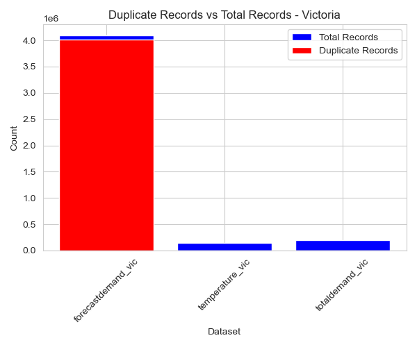

### South Australia


### Queensland

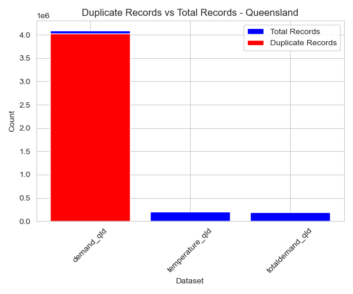

After examining these charts, it was unclear what caused the duplicates. To investigate further, the original CSV files were inspected in a text editor. It was discovered that the source of the duplicates stemmed from updates to the forecast demand files, which periodically provided new demand estimates for the same forecast time horizon. These updated estimates offered a refreshed set of demand forecasts for the same period.

Upon counting these duplicates, it was found that there were 73,836 unique values for estimating the Forecast Demand, with an average time interval between each estimate of approximately 30 minutes. This suggests that a computer model re-estimated forecast demand every 30 minutes, generating a new estimate for the value of Forecast Demand for that period.

Given the data types and context, duplicates of other field values were expected, so no duplicate checking was performed on these fields.

**5. Drop Duplicates**

To drop the duplicates, we decided as a team to select the most recent estimate of 'FORECASTDEMAND' and exclude all prior estimates from the dataframe. The following code was used:

```python
forecastdemand_qld_no_duplicates = forecastdemand_qld.drop_duplicates
(subset='DATETIME', keep='last')
```

Removing all duplicates facilitated the merging of the tables based on the DATETIME field. Consequently, the count of FORECASTDEMAND values for each of the three states (VIC, QLD, and SA) is now equal at 73,833.
 
```python
forecastdemand_qld.describe()
```

**6. Merge Dataframes by Region**

### Inspect Time Horizons
Prior to merging on the DATETIME field, further exploration of the time horizons covered by each data sets was conducted with the results shown below.


The analysis reveals that for each region, Forecast Demand typically spans from January 1, 2017, to March 19, 2021, covering a period of a bit over 4 years. In comparison, the temperature and demand data typically cover a longer period, from January 1, 2010, to March 19, 2021, totaling a bit more than 11 years.

Merging the datasets based on DATETIME naturally reduces the dataset to the smallest data range common to all three datasets. This excludes approximately 7 years of data, from January 2010 to January 2017.

Considering the size of the remaining dataset, which consists of 30-minute data over more than 4 years, it was deemed more than sufficient for training a model, especially given the computational advantages with the smaller dataset. Additionally, collecting PV data dating back to 2010 presented further challenges.

### Merge into QLD, SA and VIC dataframes

The 3 individual dataframes for each region were then merged into a single combined dataframe for each region.
1) temperature_qld
2) totaldemand_qld
3) forecastdemand_qld

The below code was used to complete a two step 'inner join' to create a single file.

```python
qld_df = pd.merge(temperature_qld, totaldemand_qld, on='DATETIME', how='inner')
qld_df = pd.merge(qld_df, forecastdemand_qld, on='DATETIME', how='inner')
```

**7. Handling Missing Values** 
Missing values were routinely checked in all dataframes during import and initial inspection. After merging the dataframes, a final check for missing values was conducted in each of the three dataframes using the following Python command. This revealed that there were no missing values in any of the dataframes.

```python
total_missing_sa = sa_df.isnull().sum().sum()
print("Total missing values SA:", total_missing_sa)
```

**8. Checking for outliers**

Boxplots were generated for the key fields of interest, including 'TEMPERATURE', 'TOTALDEMAND', and 'FORECASTDEMAND'. Upon observing these plots (for QLD), it is evident that the temperature range falls within expected values, ranging from a little above zero to slightly above 40 degrees Celsius. Additionally, 'TOTALDEMAND' and 'FORECASTDEMAND' exhibit similar patterns, as expected, and there are no outliers beyond what would normally be expected.

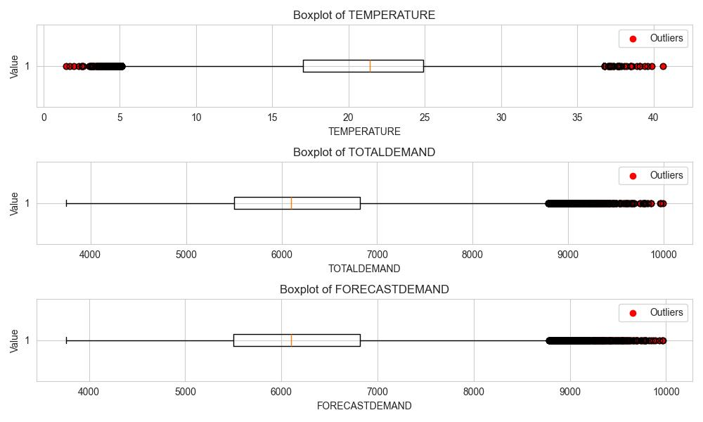

Histograms for the same fields further support this outlier analysis.

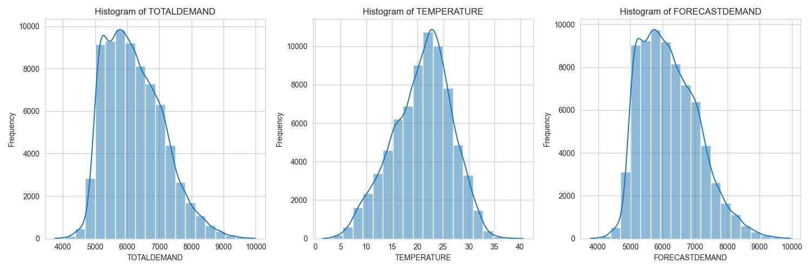


## Assumptions

The assumprions made on the data is that it is accurate and reliable. This is in addition to the assumptions about data type discussion in the previous sections.

# Modelling 

## Introduction to Modelling Methods

In this section, we present the modelling methods employed to forecast the total electricity demand in the NEM. Given the complexity of the factors influencing electricity consumption, multiple modelling approaches have been utilised to capture various patterns and dependencies in the data.

To address the challenge of forecasting electricity demand, we have deployed several statistical and machine learning models, each offering unique strengths and suited to capturing different aspects of the data. The models selected for this study include:

1. Linear Regression Model: This model leverages historical demand data to capture linear trends and seasonal variations, providing a baseline for performance comparison.
2. Neural Network Model (MLP): A Multi-Layer Perceptron (MLP), a type of neural network, is used to model non-linear relationships in the data. Its ability to learn complex patterns makes it suitable for the non-linear dynamics of electricity demand.
3. Stacked Model: Combining Generalised Boosted Models (GBM), Linear Regression, and MLP, this ensemble approach leverages the strengths of individual models to improve overall prediction accuracy. The stacking method helps in reducing the variance and bias of the forecast, capitalising on the diverse predictive capabilities of the constituent models.
4. Long Short-Term Memory (LSTM) Model: An LSTM model is specifically designed to address time-series data like electricity demand, which requires understanding long-term dependencies in data due to factors such as seasonal effects and economic cycles.

Each model has been chosen based on its potential to effectively handle the characteristics of the dataset and the specific forecasting requirements of the electricity market. The subsequent sections will detail the configuration, feature engineering, and performance evaluation of each model, providing insights into their comparative effectiveness and the rationale behind the final model selection.

## Description of Each Model

**1. Basic Linear Regression Model**

Model Overview:
Linear regression is a foundational statistical method used for modeling the relationship between a dependent variable and one or more independent variables by fitting a linear equation to observed data. The equation for a linear regression line is typically in the form:

The equation for a linear regression line is typically in the form:

$$ y = \beta_0 + \beta_1 x_1 + \dots + \beta_n x_n $$

where:
- $y$ is the predicted value,
- $\beta_0$ is the intercept,
- $\beta_i$ are the coefficients for each feature,
- $x_i$ are the feature values.

This model is well-suited for cases where the relationship between variables is expected to be linear.

Rationale for Inclusion:
The basic Linear Regression model is included in this study due to its effectiveness in providing a clear and straightforward understanding of the influences of different predictors on electricity demand. It serves as a fundamental benchmark for evaluating more complex models. The model's simplicity and interpretability are particularly valuable for initial exploratory analyses, where understanding the direct linear impact of individual factors—such as temperature, time of day, and economic indicators—on electricity demand is crucial. 

**2. Neural Network Model (MLP)**

Model Overview:
The Multi-Layer Perceptron (MLP) is a type of neural network known for its capability to model complex, non-linear relationships through its multiple layers and neurons. MLPs are widely used in pattern recognition, forecasting, and classification tasks where the relationships between variables are not easily discernible or are highly non-linear [@Nielsen2015].

The MLP model consists of multiple layers: an input layer, one or more hidden layers, and an output layer. Each layer \(l\) performs a linear transformation followed by a non-linear activation:

$$ z^{(l)} = W^{(l)}a^{(l-1)} + b^{(l)} $$
$$ a^{(l)} = \sigma(z^{(l)}) $$

Where:
- $a^{(0)}$ is the input vector,
- $W^{(l)}$ and $b^{(l)}$ are the weight matrix and bias vector for layer $l$ respectively,
- $z^{(l)}$ is the linear combination at layer $l$,
- $a^{(l)}$ is the activation after applying the non-linear function $\sigma$ at layer $l$,
- $\sigma$ is the activation function, such as Sigmoid, ReLU, or Tanh.

The output of the final layer $a^{(L)}$ is used for prediction:
$$ \hat{y} = a^{(L)} $$

This is the forward propagation mechanism. Learning in MLPs involves adjusting $W^{(l)}$ and $b^{(l)}$ through backpropagation to minimize the loss function comparing $\hat{y}$ and the actual target outputs.

Rationale for Inclusion:
The MLP model is included in this project to leverage its ability to capture intricate patterns in the data that simpler models might miss. The non-linear dynamics of electricity demand, influenced by numerous factors such as economic activity, unpredictable weather conditions, and changes in consumer behaviour, make MLP a suitable choice. 

**3. Stacked Model**

Model Overview:
A stacked model is an ensemble technique that combines the predictions from multiple individual models to produce a final output. The stacking method involves training a meta-model to synthesise the outputs of the base models into a single prediction, aiming to reduce bias and variance. In this specific application, the stacked model includes Generalised Boosted Models (GBM), Linear Regression, and a Multi-Layer Perceptron (MLP). Each base model independently processes the input data and makes predictions which are then used as inputs for the meta-model [@Wolpert1992].

For example, suppose we have $n$ base models, where each model $m_i$ provides a prediction $p_i$ for the same input data $x$. The predictions of these base models are then used as input features for the meta-model.

The process can be summarized by the following equations:

1. Each base model $m_i$ predicts the output:
$$ p_i = m_i(x) \quad \text{for} \ i = 1, 2, \ldots, n $$

2. The meta-model $M$ takes these predictions as inputs and combines them to produce the final prediction $\hat{y}$:
$$ \hat{y} = M(p_1, p_2, \ldots, p_n) $$

where:
- $x$ is the input data,
- $p_i$ is the prediction from the $i$-th base model,
- $\hat{y}$ is the final output from the meta-model.

The meta-model is trained to optimize the combination of base models' outputs, effectively learning the best way to integrate different predictive signals to minimise the overall prediction error.


Rationale for Inclusion:
The rationale for including a stacked model in this study is rooted in its ability to leverage the diverse strengths of various models to improve overall forecasting accuracy. Each of the selected base models — GBM, Linear Regression, and MLP — captures different aspects and complexities of the electricity demand forecasting problem:

GBM is adept at handling nonlinear relationships and interactions between variables, making it valuable for complex, hierarchical data structures.
Linear Regression provides clear insights into the linear relationships and is highly interpretable, which is useful for understanding direct impacts and trends.
MLP, with its deep learning capabilities, is good at at identifying patterns and dependencies in large datasets that might be non-linear or hidden.
By stacking these models, we aim to mitigate the individual weaknesses of each model and enhance prediction stability. The meta-model, a simpler model like linear regression, is trained on the predictions of the base models, ensuring that the final predictions are not just a simple average but a  weighted combination that considers how each model performs in various scenarios. 

**4. Long Short-Term Memory (LSTM) Model**

Model Overview:
Long Short-Term Memory (LSTM) models are a kind of Recurrent Neural Network (RNN) particularly well-suited to classifying, processing, and predicting time series data given time lags of unknown duration between important events. Unlike standard feedforward neural networks, LSTMs have feedback connections that allow them to process not just individual data points, but entire sequences of data [@Hochreiter1997]. This feature makes them ideal for tasks where context from the input data is crucial, such as speech recognition, language modeling, and, importantly, time-series forecasting like electricity demand.

An LSTM model is composed of various gates that control the flow of information. These gates include the forget gate, input gate, and output gate, which work together to update and maintain the cell state across time steps. The equations that govern the behavior of an LSTM unit are as follows [@Chung2014]:

1. **Forget Gate:**
   $$ f_t = \sigma(W_f \cdot [h_{t-1}, x_t] + b_f) $$
   This gate decides what information to discard from the cell state. It looks at $h_{t-1}$ (the previous hidden state) and $x_t$ (the current input), and applies a sigmoid function.

2. **Input Gate:**
   $$ i_t = \sigma(W_i \cdot [h_{t-1}, x_t] + b_i) $$
   $$ \tilde{C}_t = \tanh(W_C \cdot [h_{t-1}, x_t] + b_C) $$
   The input gate updates the cell state by first deciding which values to update (using $i_t$), and then creating a vector of new candidate values ($\tilde{C}_t$) that could be added to the state.

3. **Update Cell State:**
   $$ C_t = f_t * C_{t-1} + i_t * \tilde{C}_t $$
   The cell state $C_t$ is updated by forgetting the old state as decided by $f_t$ and adding new candidate values scaled by $i_t$.

4. **Output Gate:**
   $$ o_t = \sigma(W_o \cdot [h_{t-1}, x_t] + b_o) $$
   $$ h_t = o_t * \tanh(C_t) $$
   The output gate decides what the next hidden state should be. The state $C_t$ is passed through $\tanh$, which is then scaled by $o_t$ to decide the output $h_t$.

where:
- $x_t$ is the input vector at time step $t$,
- $h_t$ is the hidden state at time step $t$,
- $C_t$ is the cell state at time step $t$,
- $W$ and $b$ are the weights and biases for different gates,
- $\sigma$ is the sigmoid activation function,
- $\tanh$ is the hyperbolic tangent activation function.

These components work together to allow the LSTM to maintain a long-term memory, making it particularly effective for time-series data where the context from previous events is crucial for understanding the current state.


Rationale for Inclusion:
The decision to include an LSTM model in this study stems from its proven capability in handling sequential data with dependencies over time, which is a common characteristic of electricity usage data [@Huang2016]. Electricity demand forecasting involves understanding patterns that unfold over time, influenced by factors such as weather, time of day, and economic conditions. Traditional models often struggle with capturing these temporal dynamics effectively, especially when the sequences have long time dependencies.

LSTMs are designed to overcome the vanishing gradient problem that can occur with standard RNNs in the training process, allowing them to learn from data where important events are separated by long time lags. This capability is critical for accurately predicting electricity demand where previous consumption patterns and external factors like weather conditions can significantly influence future demand.

# Feature Engineering

Feature engineering was a fundamental step in the data preprocessing pipeline that significantly enhanced model performance. By transforming raw data into new features, our models signficantly improved performance over the baseline. 

**Engineered Features:**

1. Cooling Degree Days (CDD) Feature:

Description: The 'Cooling' feature represents the Cooling Degree Days, calculated as the number of degrees where the temperature is above a certain threshold (24°C here), indicating the energy demand for cooling.

Justification: This feature is essential in Australia where air conditioning is widely used. A temperature above 24°C would typically result in increased electricity usage for cooling, making this a relevant predictor for demand forecasting.

2. Heating Degree Days (HDD) Feature:

Description: The 'Heating' feature represents the Heating Degree Days, calculated as the number of degrees where the temperature is below a certain threshold (20°C here), indicating the energy demand for heating.

Justification: Similar to CDD, HDD accounts for additional energy demand for heating when the temperature drops below a comfortable threshold, a key consideration for accurate demand prediction in cooler seasons.

3. Weekend Indicator Feature:
   
Description: The 'is_weekend' binary feature indicates whether a given date falls on a weekend.

Justification: Electricity patterns often differ on weekends due to changes in commercial activity and personal routines. Recognising weekends can help the model adjust its forecasts accordingly.

4. Seasonal Feature:
   
Description: The 'season' feature categorizes dates into seasons ('Summer', 'Autumn', 'Winter', 'Spring') based on the month.

Justification: Seasonal variations significantly affect energy consumption due to weather-related changes in heating and cooling needs. This categorization aligns with Australia's distinct seasons, which correspond to varying energy usage profiles throughout the year.

5. Public Holiday Feature:
   
Description: A binary feature derived from the 'public_holidays' dataset, indicating whether a date is a public holiday.

Justification: Public holidays usually mean a reduction in commercial activity and can affect residential electricity consumption patterns. Including this feature helps in predicting atypical demand associated with holidays.


# Exploratory Data Analysis

Beginning with initial high-level checks, histograms of temperature data for each of the three regions are provided below. It is evident from the histograms that Queensland and South Australia experience higher temperatures compared to Victoria, with Queensland and South Australia being the hottest regions, followed by Victoria.

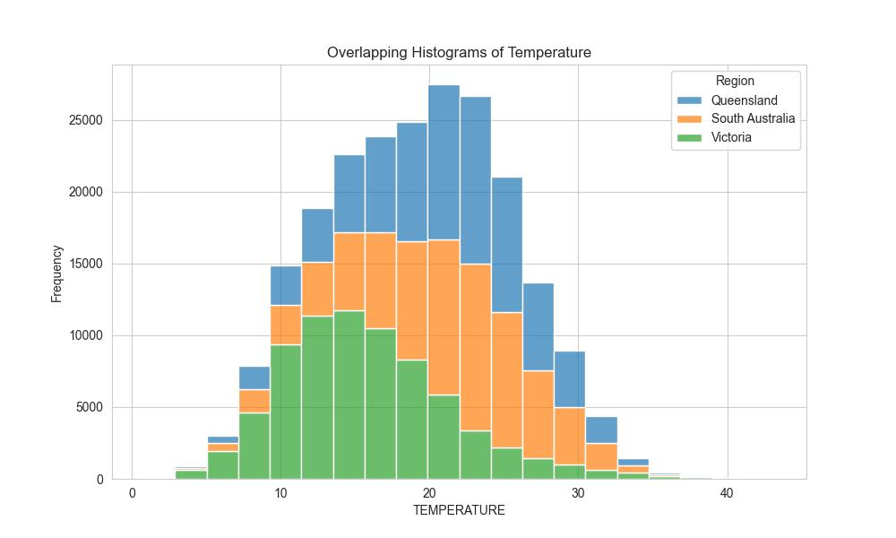

A comparison of total demand by state is shown below:

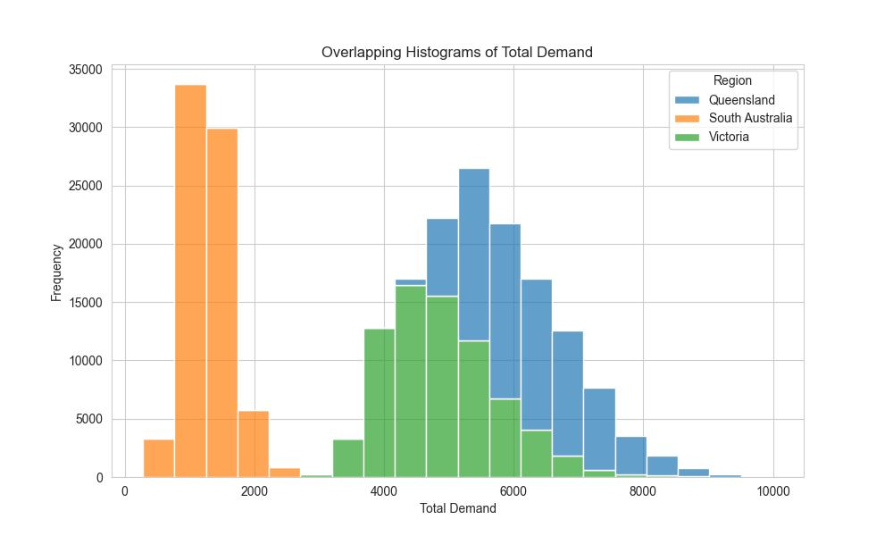


## Relationship Between Time of Day and Power Demand ##
Examining the relationship between time of day and power demand reveals interesting trends. Plotting the first 10 days of January 2010, we observe a consistent correlation throughout the day for each region, with demand typically peaking around midday and reaching its lowest point in the early morning.

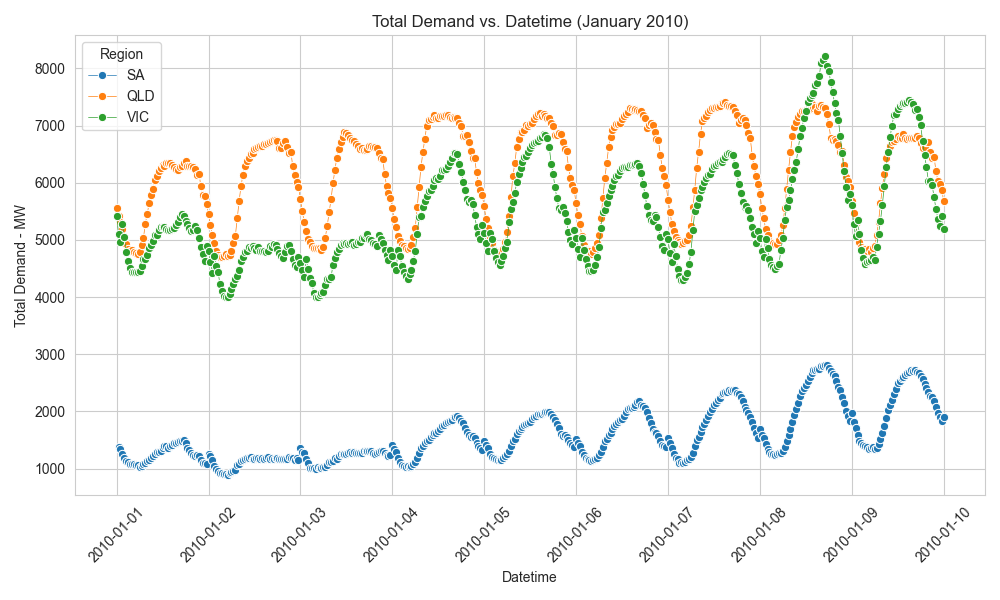

## Relationship Between Temperature and Demand ##

We know from the literature review that temperature strongly influences power demand. Filtering for different times of the day reveals this relationship in XY scatter plots for 6 AM, noon, and 6 PM. It's evident that the relationships at these times of day differ, as indicated by the shape of the relationship.


Exploring this further, focusing on 6 PM for Queensland, we observe a strong concave relationship around a low point at close to 21 degrees Celsius. Presumably, as the temperature deviates from this point and the need for air conditioning or heating increases, so does power demand.

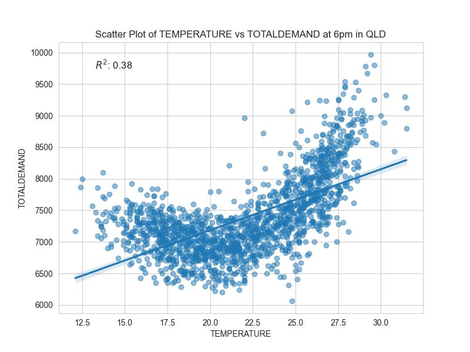

The relationship at midday is more linear in form, with average temperatures close to 25 degrees Celsius. Consequently, there is less of a requirement for heating, and possibly fewer people at home turning on air conditioners than in the evening.

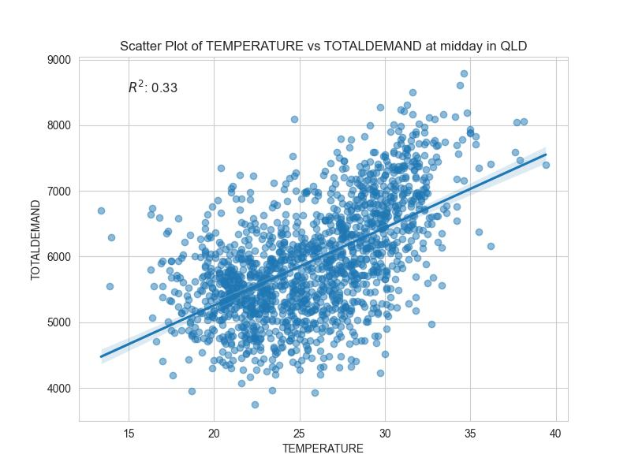

looking at 6am, we can see a somewhat similar concave relationship to 6pm, but with more variability. 

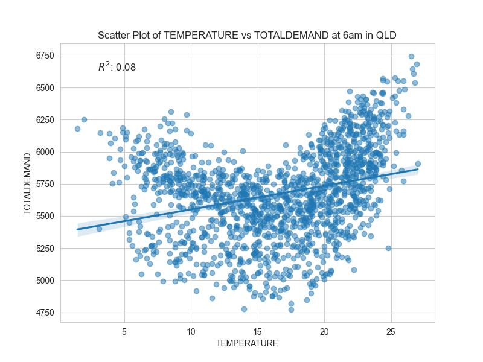

## South Australia and Victoria ##

Looking at the Victoria data, we can see a stronger response to demand as temperature decreases in the both the morning, but particularly the evening.

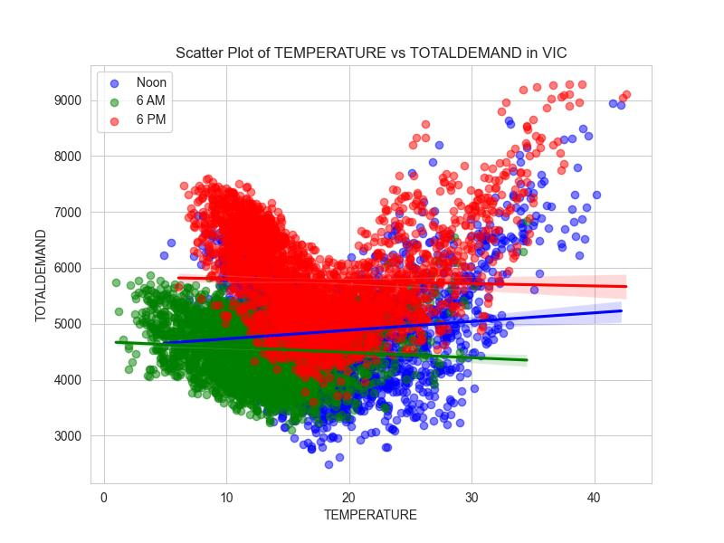

In South Australia, the trends are much less obvious, with demand generally higher in the evening. However, unlike in other regions, this trend is less driven by temperature.


# Analysis and Results

In our analysis, we focused on modeling the Queensland dataset to forecast electricity demand, based on the hypothesis that temperature data alone may be a sufficient predictor. This hypothesis was articulated as the null hypothesis:

- **Null Hypothesis** $( H_0 )\$: Temperature data alone is sufficient to reliably forecast electricity demand.

Our alternative hypothesis considered the inclusion of additional features:

- **Alternative Hypothesis** $( H_1 )\$: Including the additional features of 'solar generation capacity' and/or 'solar radiation' improves the estimate of electricity demand.

The study centered on the Queensland dataset as a proof of concept, with the intention to later replicate the methodology across other states. The performance of various models was evaluated, spanning from Linear Regression to more sophisticated approaches like MLP, LSTM, and Stacked Models, with the comparison being drawn between models leveraging only temperature data versus those incorporating engineered features.

The results, presented in the below tables, indicated a clear narrative: models augmented with engineered features outperformed their simpler counterparts across all metrics—MSE, RMSE, MAE, and $ R^2 $. The significant improvements in predictive accuracy and model fitness are evidenced by lower error rates and higher $ R^2 $ values.

Further analysis into the specific impact of solar features, as reflected in the deltas shown in the second table, suggests a substantial performance degradation when these features are excluded. For instance, excluding solar features from the Linear Regression model resulted in an MSE increase of over 103,000, underscoring the importance of these predictors.

These findings provide a strong basis to reject the null hypothesis $ H_0 $, and support the alternative hypothesis $ H_1 $. The integration of solar-related features has proven to be more than marginally beneficial—it is a significant enhancement to the accuracy of electricity demand forecasting. With the success of this proof of concept in Queensland, our methodology is poised to be replicated across other states, potentially increasing the precision of electricity demand forecasts.


| Model                                                     | MSE        |   RMSE |    MAE |     R2 |
|:----------------------------------------------------------|:-----------|-------:|-------:|-------:|
| Linear Regression                                         | 649,170.19 | 805.71 | 657.72 | 0.1878 |
| Linear Regression with Engineered Features                | 239,856.55 | 489.75 | 395.37 | 0.6947 |
| MLP with Engineered Features                              | 26,901.46  | 164.02 | 118.09 | 0.9658 |
| LSTM with Engineered Features                             | 20,508.91  | 143.21 | 103.19 | 0.9739 |
| Stacked Model with Engineered Features                    | 26,980.73  | 164.26 | 118.28 | 0.9657 |
| Linear Regression with Engineered Features - Except Solar | 342,977.48 | 585.64 | 466.78 | 0.5634 |
| MLP with Engineered Features - Except Solar               | 45,649.33  | 213.66 | 152.13 | 0.9419 |
| LSTM with Engineered Features - Except Solar              | 26,551.94  | 162.95 | 117.26 | 0.9662 |
| Stacked Model with Engineered Features - Except Solar     | 45,511.44  | 213.33 | 151.54 | 0.9421 |

<center> Table 1: Raw Results of each Model with and without solar as a feature</center>


| Model             | MSE         |   RMSE |    MAE |     R2 |
|:------------------|:------------|-------:|-------:|-------:|
| Linear Regression | -103,120.93 | -95.89 | -71.41 | 0.1313 |
| MLP               | -18,747.87  | -49.64 | -34.03 | 0.0239 |
| LSTM              | -6,043.03   | -19.74 | -14.07 | 0.0077 |
| Stacked Model     | -18,530.71  | -49.08 | -33.26 | 0.0236 |

<center> Table 2: Delta between models with and without solar as a feature</center>


Below, the first set of visualisations comprises a series of bar charts that provide an overview of the performance of various predictive models. Each chart represents a key metric used to evaluate the models, such as Mean Squared Error (MSE), Root Mean Squared Error (RMSE), Mean Absolute Error (MAE), and the coefficient of determination ($R^2$). These models include the solar variable. 


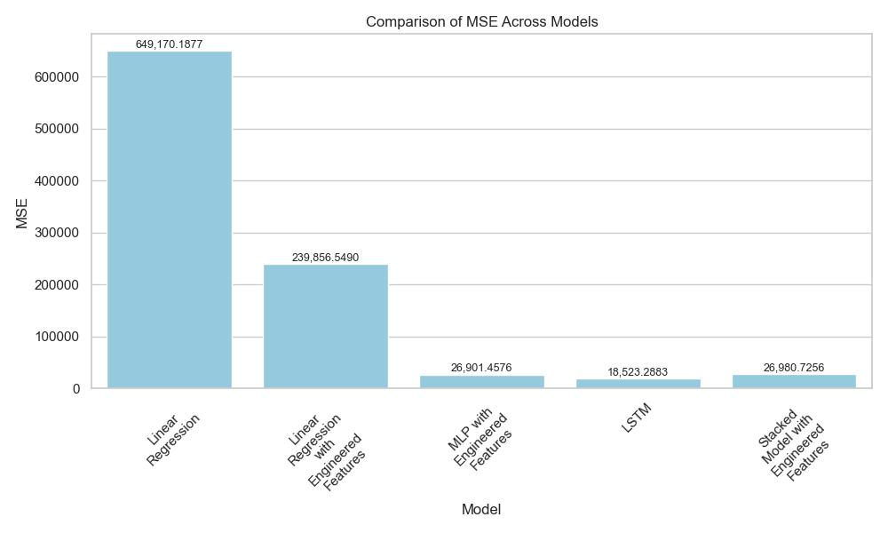


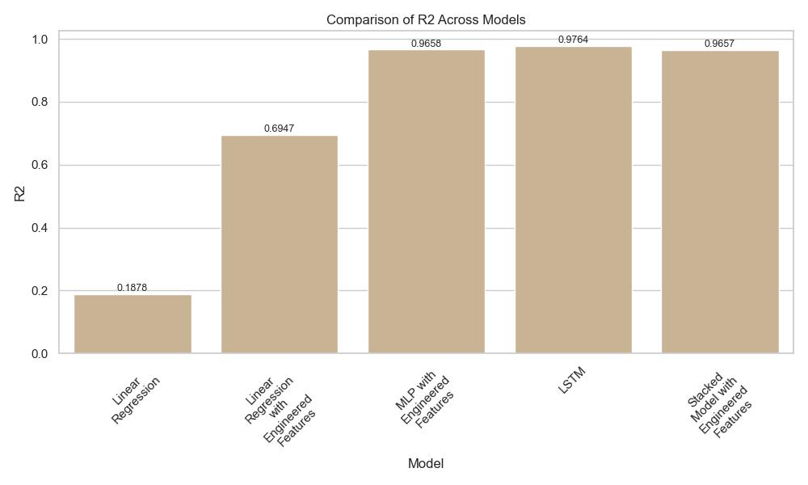


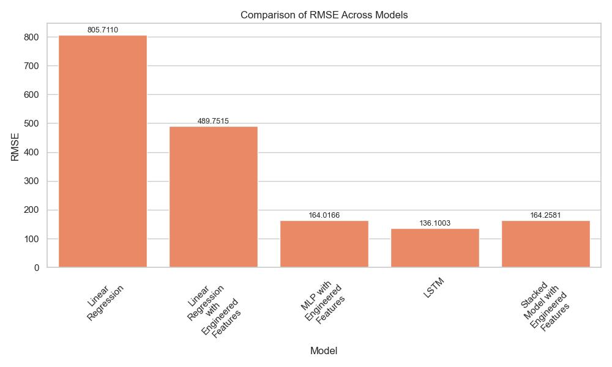

Following the histograms, the analysis transitions to a series of line plots,  tracing the performance of each individual model against the actual recorded electricity demand. The temporal snapshot chosen for this comparison is a randomly selected week in June—a period likely to exhibit significant variation in electricity usage patterns due to seasonal factors. 


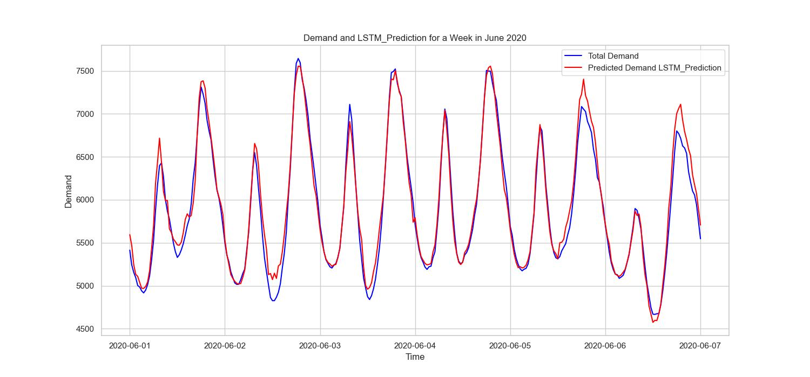


# Discussion 

From the data analysis above, we can see that there are some interesting insights. From the results, it demonstrated that the prediction is more accurate when we included rooftop solar panel power production into the dataset. This is true for all states that we analyzed, (Victoria, South Australia, and Queensland). That being said, the accuracy of the prediction varies from state to state. The Queensland model that was used for proof of concept showed a high R-squared value and low error with or without solar power as one of the engineered features. The R-squared value for LSTM model with solar feature and without is 0.9739 and 0.9662 respectively. The LSTM model with solar feature has a slightly higher R-squared value but this still shows that both models have a very high accuracy. Looking at other modeling techniques, all models with solar features outperformed the models without, in terms of r-squared value and error. Again, proofing the alternative hypothesis is correct.

The same behavior can be observed on other states as well. The modeling on Victoria and South Australia also shows better results by implementing solar power production into the model. R-squared value for Victoria model with and without solar power production are 0.9067 and 0.9033 respectively. Moreover, the solar model also has a lower error when compared. However, the improvement is marginal when compared to the improvement shown on the Queensland model. South Australia also showed an R-square value improvement of 0.0578 when compared and an improvement on RMSE and MAE, but it is worth noting that the R-squared value for both models on South Australia is low when compared to Queensland and Victoria. The best R-squared value for South Australia model is only at 0.7818 which is not sufficient for commercial demand forecasting. It is possible that more features are required in order to make the model more accurate. South Australia has a much lower population when compared to Queensland and Victoria and hence has a lower demand, further research will need to be conducted to find the cause. 

# Conclusion and Further Issues {.label:ccl}

As we conclude our study, we observe that the incorporation of engineered features, particularly those related to solar data, has markedly improved the predictive performance of all evaluated models. The enhanced models have shown a significant increase in accuracy across all key metrics, including MSE, RMSE, MAE, and the coefficient of determination ($R^2$).

To further refine the predictive capabilities, we suggest the following potential new engineered data features:

1. **Behavioral Adjustments**: Incorporating data on school holidays and other public events that typically see a shift in electricity usage patterns.
2. **Household Efficiency Metrics**: Integrating data on energy efficiency improvements within households, such as the adoption of energy-efficient appliances and systems.
3. **Population Growth Projections**: Utilising demographic and urban planning data to adjust forecasts according to expected changes in population density and growth.
4. **Electric Vehicle Uptake**: Factoring in the increase in electric vehicle (EV) usage, which significantly impacts electricity demand due to charging requirements.

For future analysis, several avenues could be explored:

1. **Expansion of Feature Set**: Investigating additional environmental, economic, and behavioral factors in addition to the above that could further refine the predictive models.
2. **Longer Time Frame**: Extending the analysis to include a broader range of data over more recent years to validate the models against more varied conditions.
3. **Real-Time Analysis**: Developing a framework for real-time data analysis to enable dynamic forecasting that can adapt to rapid changes in demand patterns.

These initiatives could provide deeper insights and drive the evolution of forecasting methodologies to meet the complex demands of modern energy management systems.


# References {-}

<div id="refs"></div>

\bibliographystyle{elsarticle-harv}
\bibliography{references}

# Appendix {-}

## **Codes** {-}

Add you codes here.

## **Tables** {-}


